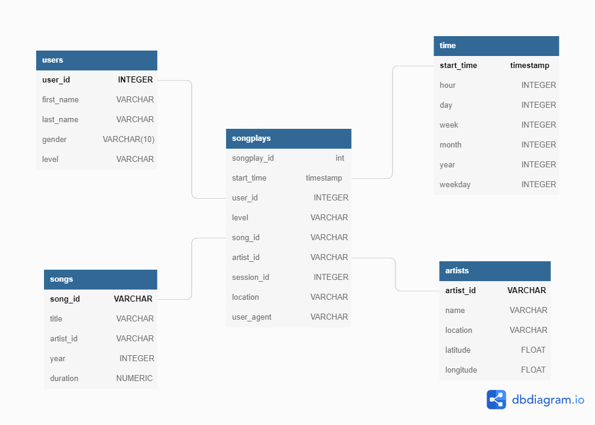

# Project: Data Modeling with Postgres

> by Ofili Lewis Obiajulum | 8th May 2022

## Introduction

A startup called Sparkify wants to analyze the data they've been collecting on songs and user activity on their new music streaming app. The analytics team is particularly interested in understanding what songs users are listening to. Currently, they don't have an easy way to query their data, which resides in a directory of JSON logs on user activity on the app, as well as a directory with JSON metadata on the songs in their app.

They'd like a data engineer to create a Postgres database with tables designed to optimize queries on song play analysis, and bring you on the project. Your role is to create a database schema and ETL pipeline for this analysis. You'll be able to test your database and ETL pipeline by running queries given to you by the analytics team from Sparkify and compare your results with their expected results.

## Project Description

In this project, you'll apply what you've learned on data modeling with Postgres and build an ETL pipeline using Python. To complete the project, you will need to define fact and dimension tables for a star schema for a particular analytic focus, and write an ETL pipeline that transfers data from files in two local directories into these tables in Postgres using Python and SQL.

## Datasets

#### Song Dataset

The first dataset is a subset of real data from the [Million Song Dataset](http://millionsongdataset.com/). Each file is in JSON format and contains metadata about a song and the artist of that song. The files are partitioned by the first three letters of each song's track ID. For example, here are filepaths to two files in this dataset:

`song_data/A/B/C/TRABCEI128F424C983.json`
`song_data/A/A/B/TRAABJL12903CDCF1A.json`

And below is an example of what a single song file, TRAABJL12903CDCF1A.json, looks like.

`{"num_songs": 1, "artist_id": "ARJIE2Y1187B994AB7", "artist_latitude": null, "artist_longitude": null, "artist_location": "", "artist_name": "Line Renaud", "song_id": "SOUPIRU12A6D4FA1E1", "title": "Der Kleine Dompfaff", "duration": 152.92036, "year": 0}`

#### Log Dataset

The second dataset consists of log files in JSON format generated by this [event simulator](https://github.com/Interana/eventsim) based on the songs in the dataset above. These simulate activity logs from a music streaming app based on specified configurations.

The log files in the dataset I was working with are partitioned by year and month. For example, here are filepaths to two files in this dataset:

`log_data/2018/11/2018-11-12-events.json`
`log_data/2018/11/2018-11-13-events.json`

And below is an example of what the data in a log file, 2018-11-12-events.json, looks like:

## Files

In addition to the data files, the project includes six files:

1. `test.ipynb` displays the first few rows of each table to let me check my database.
2. `create_tables.py` drops and creates tables. I run this file to reset my tables before each time I run the ETL scripts.
3. `etl.ipynb` reads and processes a single file from song_data and log_data and loads the data into the tables. This notebook contains detailed instructions on the ETL process for each of the tables.
4. `etl.py` reads and processes files from song_data and log_data and loads them into the tables. It's based on my work in the ETL notebook.
4. `sql_queries.py` contains all my sql queries, and is imported into the last three files above.
5. `README.md` then provides an introduction to this project.

## Database Schema for Song Play Analysis

Using the song and log datasets, I created a denormalized star schema optimized for fast agregations and simplified queries on song play analysis. This includes one fact table of **songplays** and four dimension tables for **users, songs, artists, and time**:

## ETL Pipeline

Extract, transform, load (ETL) is the general procedure of copying data from one or more sources into a destination system which represents the data differently from, or in a different context than, the sources.

#### Extracting and Transforming the Data

The ETL pipeline extracts data from files in two directories:
- /data/log_data and 
- /data/song_data.

It then transforms and loads the data into the five tables of the sparkifydb database. This is handled by four files using Python and SQL:
- Running `create_tables.py` creates and initializes the tables for the sparkifydb database.
- Running `test.ipynb` confirms the creation of my tables with the correct columns.
- Running `etl.ipynb` develops ETL processes for each table and is used to prepare a python script for processing all the datasets.
- `sql_queries.py` contains all SQL queries and is imported into `create_tables.py` and `etl.ipynb`

#### Loading the Data and Running ETL Pipeline

The codes are first written in `etl.ipynb` file and then used to complete `etl.py`.
The `etl.py`reads and processes all the files from the song_data and log_data directories, and loads them into the sparkifydb database tables.

The steps to run the pipeline are as follows:

1. In a terminal, run `python create_tables.py` to reset the tables in the sparkifydb database.
2. Running `test.ipynb` (in a jupyter notebook or jupyter lab) confirms that the tables were successfully created with the correct columns.
3. In a terminal, run `python etl.py` to process all the datasets.
4. Again, running `test.ipynb` confirms that the records were successfully inserted into each table.

#### Sample Queries

Get the number of paid and free plans by gender:  
`%sql SELECT count(user_id), level, gender FROM users GROUP BY level, gender`

